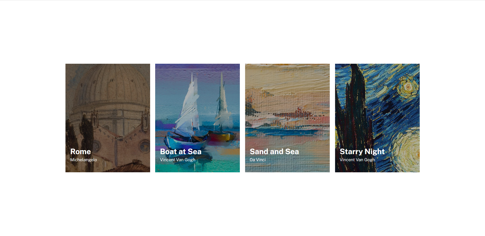

# ✨Projeto- Imagens com Flexbox

## 📕Descrição

Este projeto se trata de uma página onde podemos encontrar 4 pinturas famosas.

Dentro das pinturas, podemos encontrar o nome das obras e de seus autores.

Dependendo das dimensões do dispositivo utilizado, as pinturas podem ser dispor lado a lado (Desktop), ou verticalmente (telas de celulares)

 

## 🧾Linguagens Utilizadas

- Html
- Css

 

## ❓Modo de Uso

Caso o usuário clique em alguma das pinturas, ele será redirecionado novamente para a página.

 

## 📸Screenshots
 

### 💻Desktop

### 📱Mobile

## 🖊Autor: João Francisco Fortes André